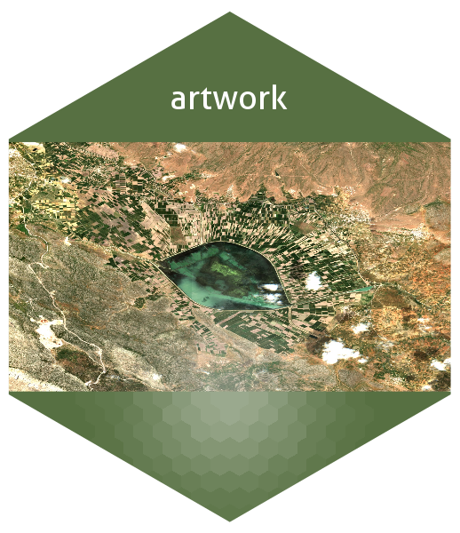
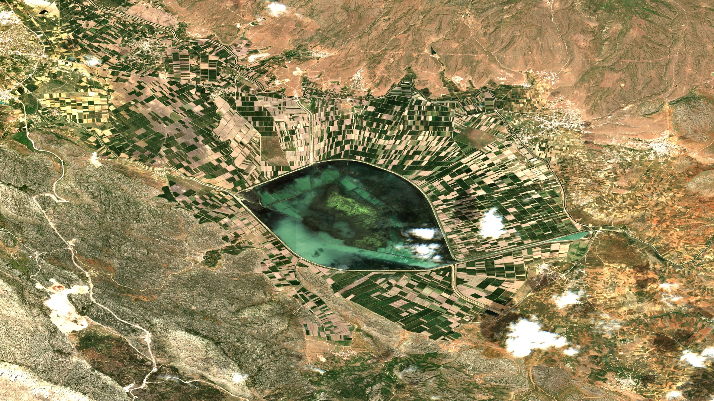
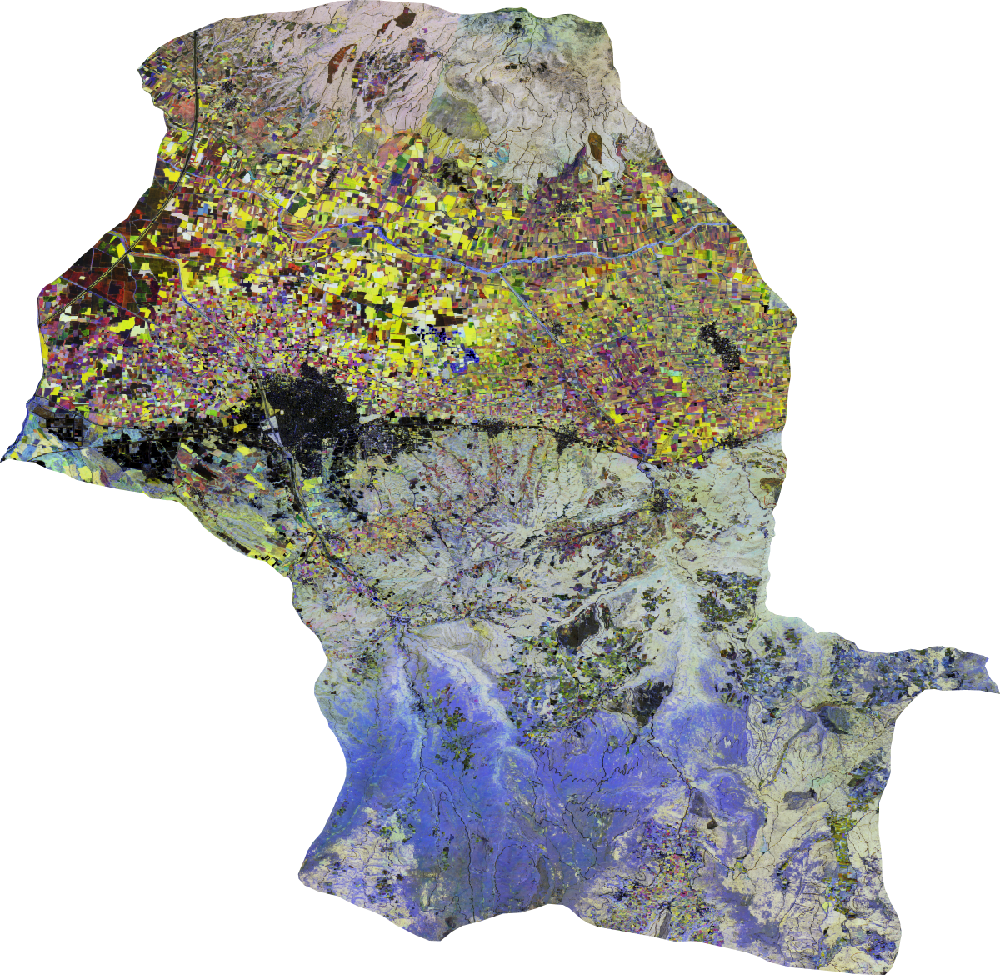
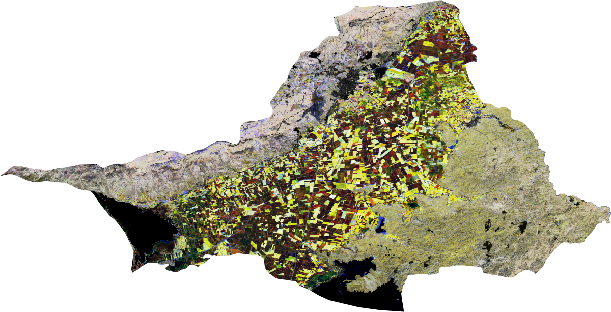
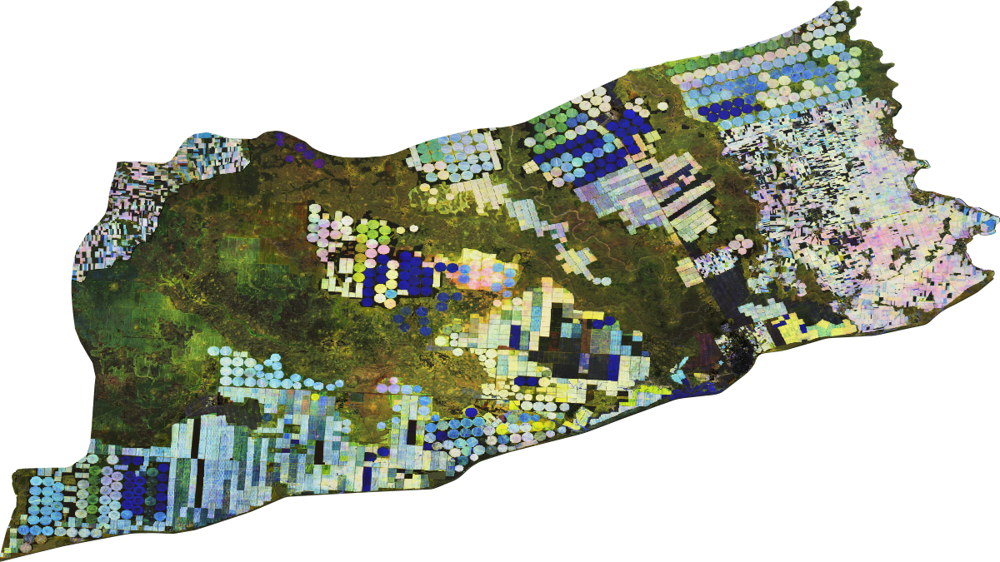

# Geospatial Artwork 

This repository consists of materials that I produce
on geospatial data. The works are linked to their source code.

#### The Eye of Lake Suğla

Lake Suğla is a karst lake located southeast of Konya, Turkey. In dry seasons, the area of the lake shrinks, and the alluvial lake bed emerges as fertile land for agriculture. The lake was fed with the waters from Lake Beyşehir, where I was born. Since there was a change in the water transfer, Lake Suğla became drier and shrunk from `16k ha` to `2.5k ha`. Though the renewal plan 1999 enlarged the size to `4k ha`, the lake floods during the rainy years to get back to what it belongs. The eye of the lake wants you to hear its story with *wet* eyes. 

| [Konya Suğla](https://code.earthengine.google.com/6c67dd40f4030ccaf9f267d89b3e123d) |
| :---:       |
<a href='https://code.earthengine.google.com/da4b40d1006d1fc5ceae3b19b4354ae6'> 

</a>

#### Variance in Time

We like to simplify the world around us. Nature does not have such a goal. When we look at a typical image, we unconsciously start classifying structures such as mountains, agricultural fields, cities, etc., on the image. We continue; some resource planners think about how we can calculate the areas of these structures. Suppose we know the forest area and can better plan and manipulate nature. If we knew all the cotton fields in an image, for example, we could calculate the areas of cotton fields, which would give us some idea of the cotton supply for that region.

You are always looking at a typical image with many assumptions you fill in your mind in your lifetime. The cotton fields do not know they are cotton fields, and the trees do not know what you are thinking about them. You can only unbiasedly observe that these structures all vary in time and space; some are more, and some are less. The images below use different times’ [`NDVI`](https://eos.com/make-an-analysis/ndvi/) values to show you the variance in time. Similar colors seem to act similarly, but still, be careful to assume their class.

| [Manisa Turgutlu](https://code.earthengine.google.com/5a43eec873e1be144c425ccd0190c9da) | [Aydın Söke](https://code.earthengine.google.com/b3c376276c2cb88bb3be2bcd181ef464) | [Şanlıurfa Ceylanpınar](https://code.earthengine.google.com/5b5a77027e1353f130e9efade56cd9eb) |
| :---:        |     :---:      |          :---: |
|    |      |     |

#### Computer Vision of The Edges

Some people theorize you only first see the edges when you see anything. This work, inspired by an article, tries to replicate that essential skill. 

| [Adana Ceyhan](https://github.com/bkavlak/BoundaryGEE) |
| :---:       |
|  |
